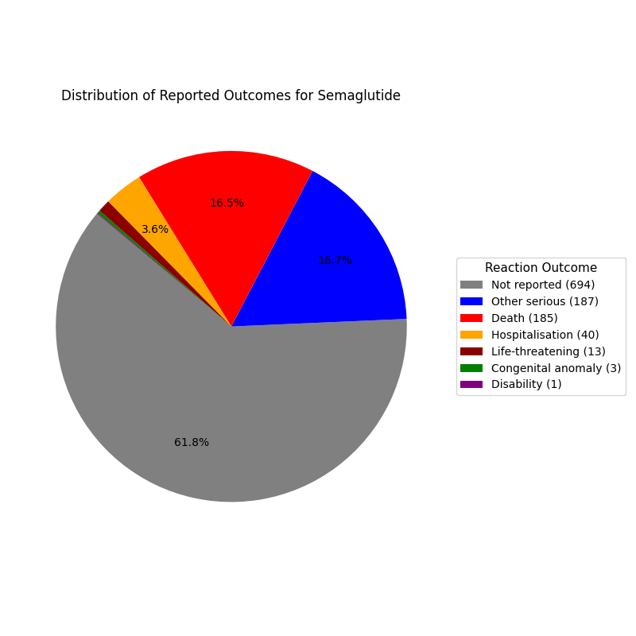
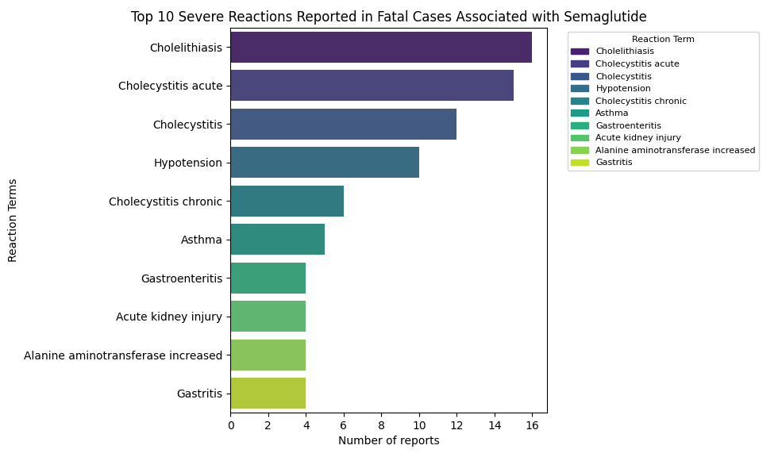
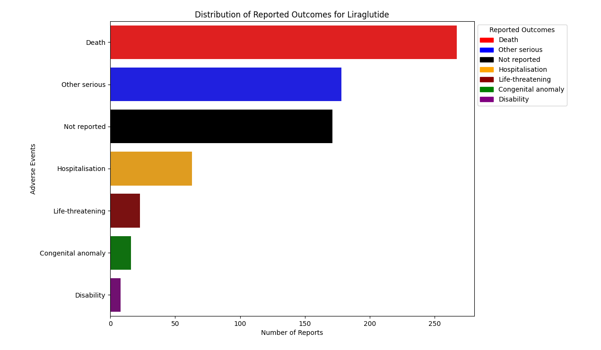
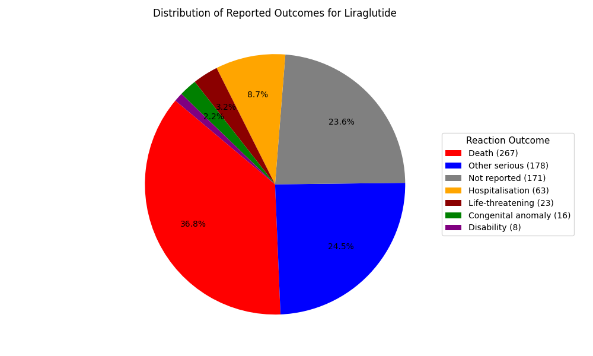
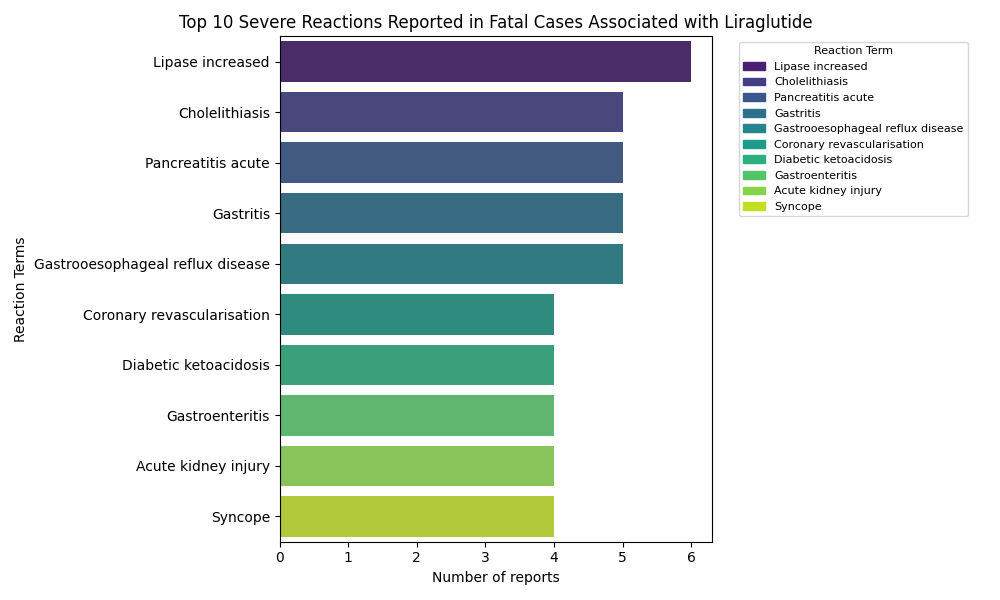
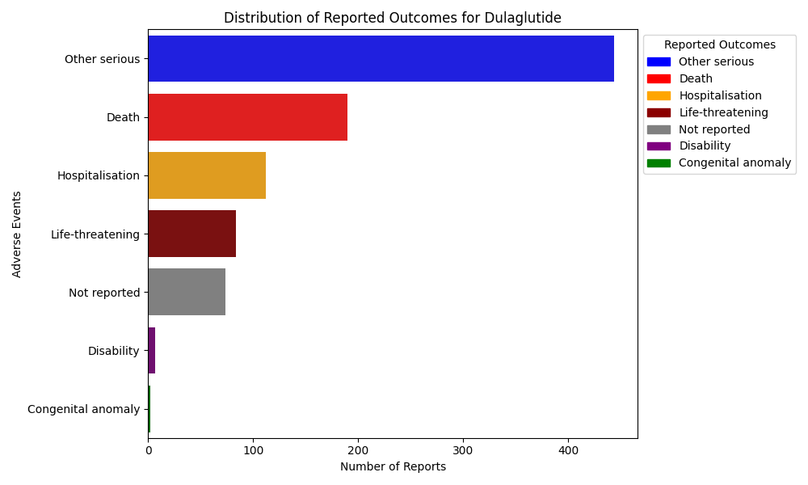
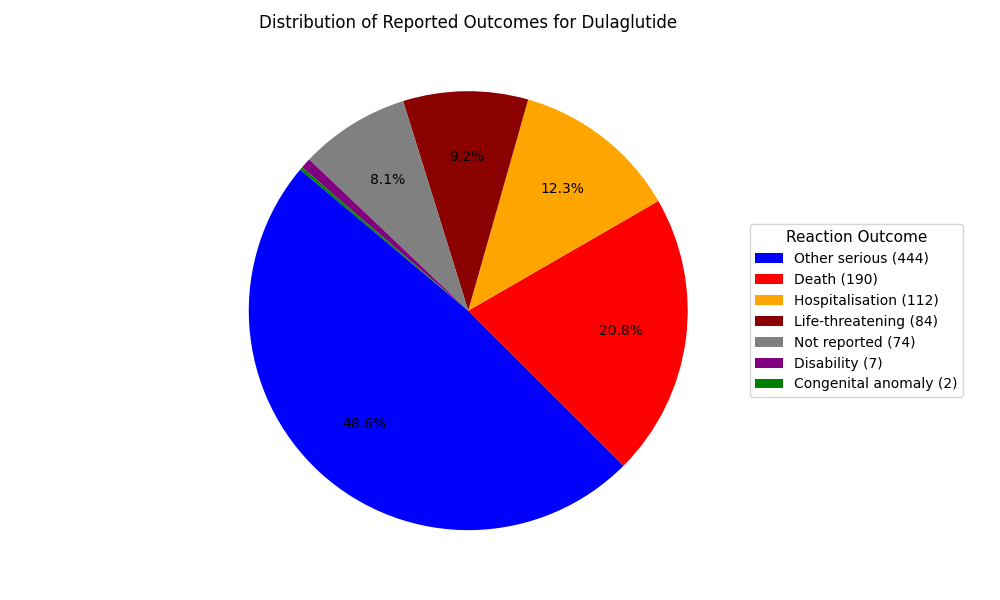
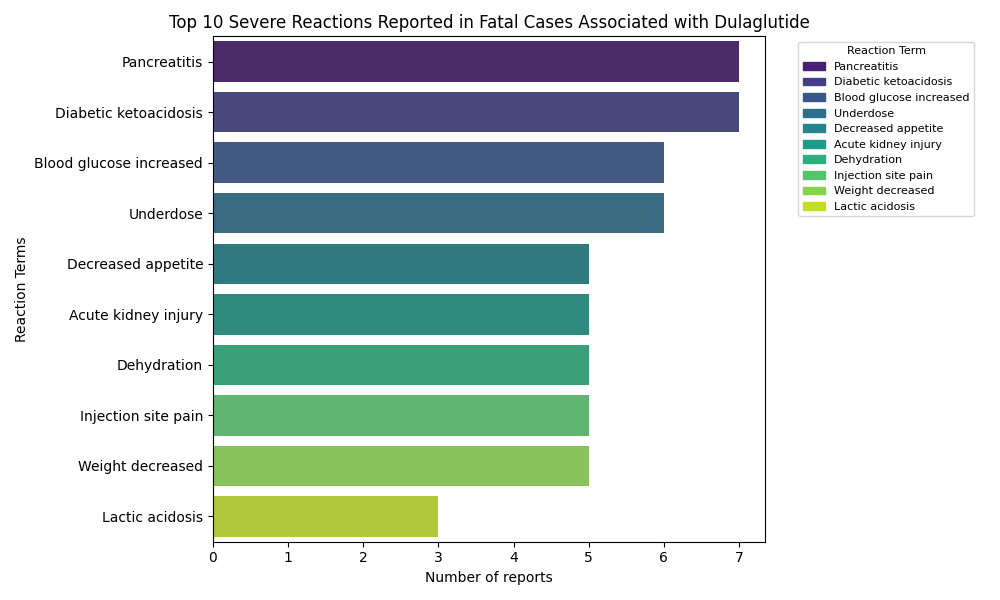

# faers-adverse-events-analysis
Analysis of FAERS adverse event reports for GLP-1 drugs using Python, Pandas and seaborn
# FAERS Adverse Event Analysis for GLP-1 Drugs

## Project Overview

This project analyses adverse event reports from the FDA FAERS database for three GLP-1 receptor agonists:

- Semaglutide
- Liraglutide
- Dulaglutide

The analysis identifies the most commonly reported adverse reactions and compares safety profiles across the drugs.

## Data Source

FDA FAERS (FDA Adverse Event Reporting System)

https://open.fda.gov/apis/drug/event/

## Project Structure

```
main.py
    Runs the data retrieval pipeline

data_retrieval/
    liraglutide.py
    semaglutide.py
    dulaglutide.py
    Fetches FAERS reports for each drug

analysis/
    lira_adverse.py
    sema_adverse.py
    dula_adverse.py
    Performs adverse event analysis and visualisation

outputs/
    charts/
    excel/
    Generated visualisations and exported datasets
```

## Analysis Performed

- Extraction of FAERS drug reports
- Filtering primary suspect drugs
- Reaction extraction from nested JSON
- Aggregation of adverse event counts
- Identification of severe adverse reactions
- Visualisation of most frequently reported reactions

## Technologies

- Python
- Pandas
- Matplotlib
- Seaborn
- OpenFDA API

## Example Findings

Commonly reported reactions across GLP-1 drugs include:

- Nausea
- Vomiting
- Diarrhoea
- Decreased appetite

These results align with known side-effect profiles of GLP-1 receptor agonists.

## Example Visualisations

### Semaglutide Adverse Reactions





### Liraglutide Adverse Reactions





### Dulaglutide Adverse Reactions






## Author

Qudsia Imtiaz
